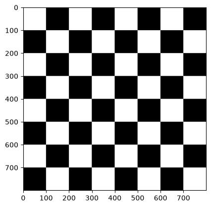
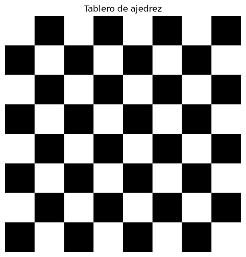

# Practica 1 VC

Ejercicios de la primera semana de laboratorio de VC.

Nicolás Hernández Castro - Gabriel Godoy Navarro - EII ULPGC 16 de septiembre de 2026

## Tarea 1: Tablero de Ajedrez
### Forma manual:
Para generar el tablero de ajedrez se inicializa la matriz de 800×800 píxeles con un único canal en negro mediante `np.zeros()`. A continuación, se emplean dos bucles for anidados para iterar en saltos de 100 píxeles a lo largo de las filas y columnas para rellenar los cuadrados que corresponderian a las casillas blancas dentro del bucle. La condición `(i // tamaño + j // tamaño) % 2 == 0` evalúa la paridad de la coordenada de cada casilla para determinar que corresponda con una casilla blanca y pintar de blanco (255) las regiones correspondientes. Finalmente, la imagen resultante se renderiza en pantalla en escala de grises utilizando `plt.imshow` y se despliega con `plt.show()`.


### Con asistente IA:
El asistente IA genera el tablero de ajedrez de forma vectorizada y sin bucles explícitos. Define en primer lugar una matriz bidimensional de 2×2 mediante `np.array(..., dtype=np.uint8)` que contiene la alternancia inicial entre blanco (255) y negro (0). A continuación, emplea la función `np.tile(patron_base, (4, 4))` para replicar dicho bloque cuatro veces en cada eje y conformar la cuadrícula lógica de 8×8 celdas. Seguidamente, escala cada casilla al tamaño deseado de 100×100 píxeles calculando el producto tensorial de Kronecker con `np.kron()`, multiplicando la matriz del tablero por un bloque de unos generado con `np.ones((100, 100), dtype=np.uint8)` para alcanzar una resolución total de 800×800 píxeles.


Al hacerlo de forma manual el codigo es mas intuitivo, ya que recorre la matriz celda a celda con dos bucles `for` y pinta las casillas blancas que correspondan, pero requiere más código y es algo más lenta al ejecutarse en Python puro. Por contra, la solución con IA es más compacta y eficiente, ya que resuelve el tablero en apenas tres líneas usando `np.tile` y `np.kron` para generar y escalar el patrón sin ningún bucle, pero es mas complicada de  entender.


## Tarea 2: Composición estilo Mondrian

En este ejercicio se usan las funciones de la librería OpenCV para crear una composición abstracta estilo Mondrian sobre una imagen de 600 x 600 píxeles. Primero, se inicializa un fondo blanco puro utilizando matrices de NumPy. A través de las funciones `cv2.rectangle()` y `cv2.line()`, se dibujan líneas y rellenos de colores primarios (rojo, amarillo y azul).

A las funciones se le pasan la imagen, las coordenadas de comienzo y final del dibujo, el color (en formato RGB) y el grosor. En el caso de los rectángulos, se le pasa un grosor de `-1` para que la figura se rellene de color sólido, mientras que a las líneas negras se les aplica un grosor de `8`. De esta manera, se van formando las figuras con unas pocas llamadas a las funciones.


### Tarea 4: Diseño PopArt

Se realizarán cambios en una misma imagen para desarrollar una propuesta de PopArt. Para ello, primero de cogen las dimensiones de la cámara y las reducimos a la mitad para calcular el espacio del collage. La imagen resultante para cada cuadrante será de 1/4 de la original, correspondiendo así a una esquina de la composición final:

```python
w = int(vid.get(cv2.CAP_PROP_FRAME_WIDTH) / 2)
h = int(vid.get(cv2.CAP_PROP_FRAME_HEIGHT) / 2)
vid.set(cv2.CAP_PROP_FRAME_WIDTH, w)
vid.set(cv2.CAP_PROP_FRAME_HEIGHT, h)
```

Posteriormente, se crea el collage vacío con un lienzo negro, multiplicando por 2 las dimensiones reducidas anteriormente. Para facilitar la manipulación, se divide el lienzo y se asigna cada bloque del collage de manera simétrica jugando con las dimensiones de las esquinas (tl, tr, bl, br):

```python
collage = np.zeros((h*2, w*2, 3), dtype=np.uint8)
tl = collage[0:h, 0:w]
tr = collage[0:h, w:w+w]
bl = collage[h:h+h, 0:w]
br = collage[h:h+h, w:w+w]
```
Para el resto del ejercicio solo queda asignar los estilos de PopArt a cada una de las cuatro divisiones del collage durante el bucle de captura. Para generar variedad, se transforma el fotograma a escala de grises y utilizando funciones de la librería OpenCV y con matrices de Numpy:

**Arriba Izquierda (Warhol Suave)**: Se aplica un mapa de color automático usando la función `cv2.applyColorMap()` con el parámetro COLORMAP_SPRING.

**Arriba Derecha (Psicodélico)**: Se convierte la imagen al espacio de color HSV con `cv2.cvtColor()`, se separan sus canales (``cv2.split()``) y se aplican operaciones matemáticas para rotar el tono y saturar los colores antes de volver a unirlos.

**Abajo Izquierda (Duotono Pop)**: Se binariza la imagen usando ``cv2.threshold()`` para separar las sombras de las luces, y se colorea el resultado utilizando máscaras booleanas.

**Abajo Derecha (Neón)**: Se detectan los bordes de la silueta mediante ``cv2.Canny()`` y se superponen tintados de verde brillante usando la función ``cv2.addWeighted()``

**USO DE IA**: Le hemos preguntado ideas para hacer el PopArt a Gemini para obtener variedad de estilos tales como: **Warhol Suave**, **Psicodélico**, **Duotono Pop** y **Neón**. Nos ha respondido con las funciones de la librería OpenCV que desconocíamos y propuso para ayudarnos y hemos aplicado.
